<div align="center">

<picture>
  <source media="(prefers-color-scheme: dark)" srcset="./dark.svg">
  <source media="(prefers-color-scheme: light)" srcset="./light.svg">
  
</picture>

# Aditi Rathi

### Backend Developer | Building Scalable APIs & Intelligent Backend Systems

<p>
  <a href="https://github.com/Aditi-Unix">GitHub</a> •
  <a href="https://www.linkedin.com/in/aditi-rathi-147a0a352/">LinkedIn</a> •
  <a href="mailto:rathiaditi881@gmail.com">Email</a>
</p>

</div>

## About Me

I'm a **Backend Developer** focused on building secure, scalable, and maintainable backend systems using **Node.js, Express.js, and MongoDB**.

- 🎓 B.Tech in Computer Science
- ⚙️ Building REST APIs, authentication systems, and backend services
- 🔐 Working with JWT authentication and Google OAuth
- 🤖 Exploring AI integration in backend applications
- 🗄️ Interested in API architecture, databases, security, and scalable systems
- 🚀 Currently strengthening backend engineering and problem-solving skills

## Tech Stack

**Backend:** Node.js • Express.js • REST APIs  
**Database & BaaS:** MongoDB • Mongoose • Supabase  
**Authentication & Security:** JWT • bcrypt • Google OAuth  
**Languages:** JavaScript • C++  
**AI & APIs:** AI API Integration • Third-party REST APIs  
**DevOps & Tools:** Docker • Git • GitHub • Postman • VS Code

## Featured Backend Projects

### 🤖 AI-Powered Chatbot
A backend-focused AI chatbot system combining secure authentication, persistent chat storage, and AI-generated responses.

**Highlights:** Node.js • Express.js • MongoDB • JWT • AI Integration • REST API

[View Repository](https://github.com/Aditi-Unix/AI-Powered-Chatbot)

### 🔐 Google OAuth Backend
Authentication backend implementing Google OAuth login and backend-side user authentication flows.

**Highlights:** Node.js • Express.js • MongoDB • Google OAuth • Authentication • REST API

[View Repository](https://github.com/Aditi-Unix/Google-Outh)

### ✅ Todo REST API
RESTful backend API for managing todos with MongoDB persistence and structured CRUD operations.

**Highlights:** Node.js • Express.js • MongoDB • Mongoose • CRUD • REST API

[View Repository](https://github.com/Aditi-Unix/todo-management-rest-api)

### 🌦️ Weather REST API
Backend API that integrates an external weather service and exposes weather data through a clean Express API.

**Highlights:** Node.js • Express.js • Axios • External API Integration • REST API

[View Repository](https://github.com/Aditi-Unix/weather-rest-api)

## What I'm Focusing On

```text
Backend Engineering   ███████████████████░
REST API Design       ███████████████████░
Authentication        ██████████████████░░
MongoDB               ██████████████████░░
AI Integration        ████████████████░░░░
DSA / Problem Solving ████████████████░░░░
```

## GitHub Activity

<p align="center">
  
  
</p>

## Connect With Me

I'm interested in **backend development opportunities, internships, and projects** where I can work on APIs, authentication, databases, and intelligent backend systems.

**GitHub:** https://github.com/Aditi-Unix  
**LinkedIn:** https://www.linkedin.com/in/aditi-rathi-147a0a352/  
**Email:** rathiaditi881@gmail.com

---

<div align="center">
  <sub>Building reliable backend systems, one API at a time.</sub>
</div>
